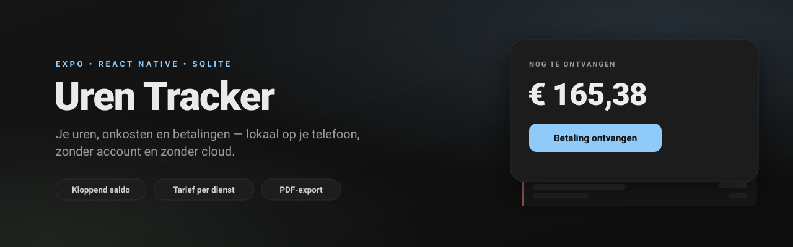
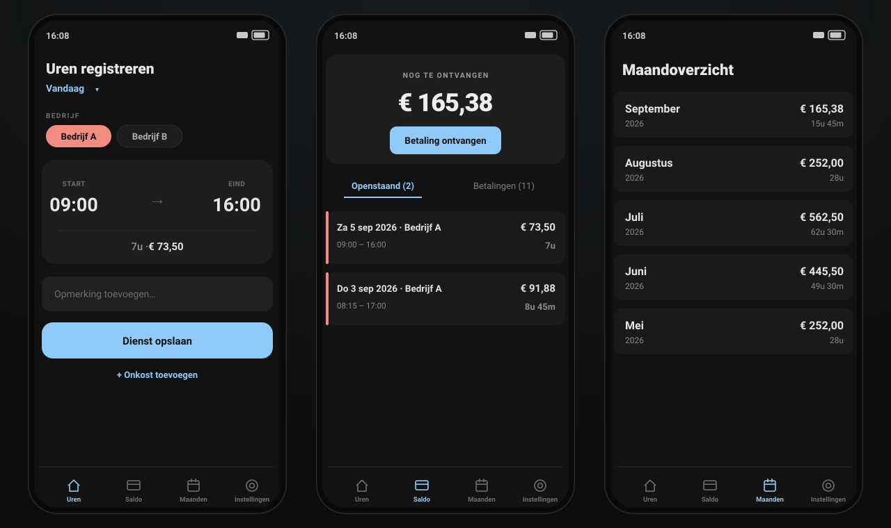

<p align="center">
  
</p>

# Uren Tracker

Een Expo-app om je gewerkte uren, onkosten en betalingen bij te houden. Alles
staat lokaal in een SQLite-database op je telefoon — geen account, geen server.

<p align="center">
  
</p>

<p align="center"><sub>Ontwerpweergave van de schermen — bedrijfsnamen zijn voorbeelden.</sub></p>

## Wat je met de app kunt

- **Uren registreren** per bedrijf, met start- en eindtijd
- **Onkosten** toevoegen, met bonfoto's
- **Betalingen** ontvangen (met datum en notitie); de app streept automatisch de
  oudste openstaande posten af
- **Openstaand saldo** dat altijd klopt met de lijst eronder
- **Uurtarief per dienst vastgezet** — een tariefwijziging raakt alleen diensten
  die je daarna toevoegt
- **Maandoverzichten** met verdiensten, uren en gewerkte dagen
- **PDF-export** van je open uren of een hele maand
- **Back-up** naar JSON en terugzetten
- Donker en licht thema

## Techniek

- Expo SDK 57 + React Native, Expo Router, TypeScript
- Lokale SQLite database (`expo-sqlite`)
- Zustand voor state
- De rekenlogica staat als pure functies in `utils/calculations.ts` met een
  unit-testsuite

## Ontwikkelen

```sh
npm install
npx expo start
```

Controles:

```sh
npm test            # unit tests (ts-jest)
npx tsc --noEmit    # types
npm run lint
```

## Disclaimer

Dit project is volledig gemaakt met behulp van AI-tools.
Deze software wordt aangeboden zoals ze is, zonder enige expliciete of impliciete garantie.
Gebruik van dit project is volledig op eigen risico.
De maker/beheerder is niet verantwoordelijk of aansprakelijk voor fouten, uitval, dataverlies, financiële schade of andere directe of indirecte gevolgen van het gebruik van deze software.
